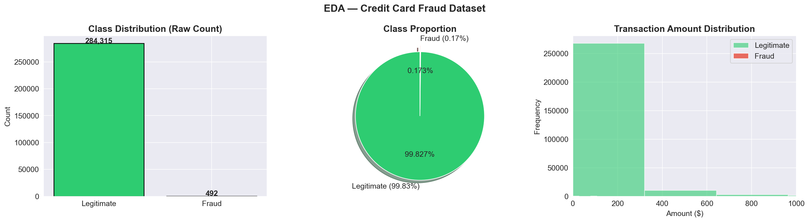
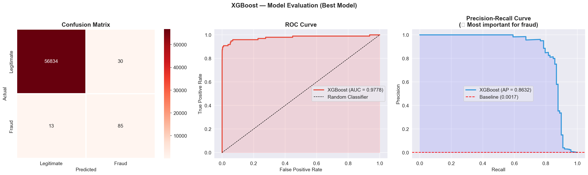
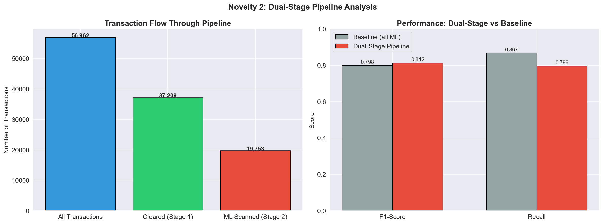
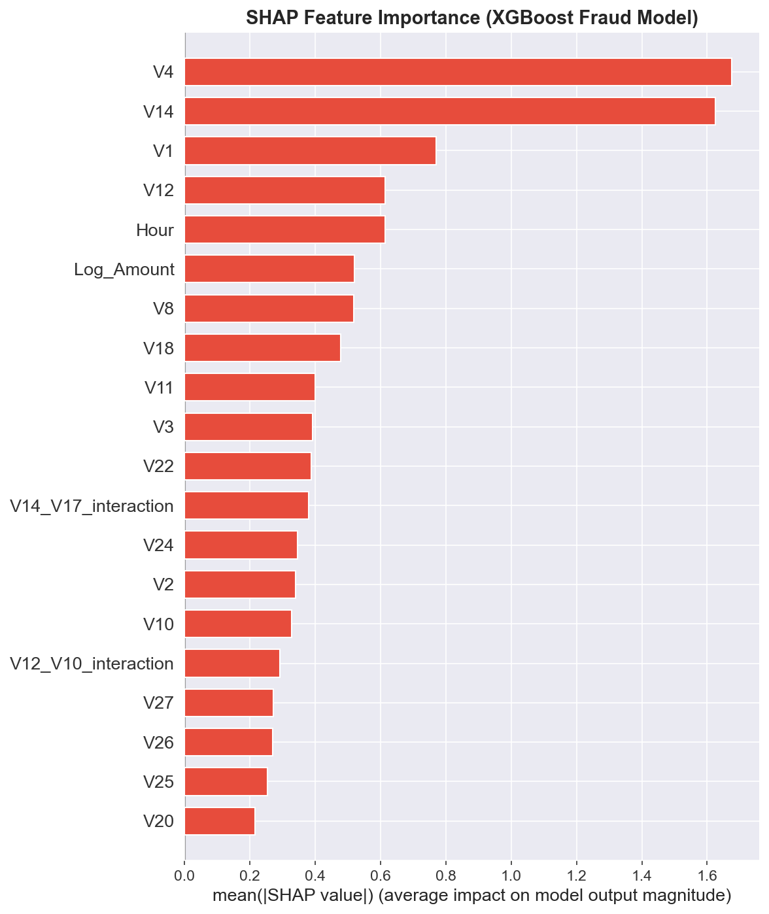

#  Adaptive Fraud Intelligence System (AFIS)
### Credit Card Fraud Detection — Dual-Stage Pipeline + SHAP Investigation Reports

##  Project Overview
Detects credit card fraud on 284,807 real European bank transactions (0.17% fraud rate).
Goes beyond standard detection with two novelties built from scratch.

## Novelties
- **Dual-Stage Pipeline** — Rule-based fast filter (Stage 1) + XGBoost ML scan (Stage 2)
  Mirrors how Stripe and Razorpay actually process transactions in production
- **SHAP Auto-Investigation Report** — Every flagged transaction gets a human-readable
  brief showing top risk factors, SHAP contributions, and recommended action (Block/Hold/Approve)

## Tech Stack
Python | Pandas | NumPy | XGBoost | Scikit-learn | SMOTE | SHAP | Plotly | Matplotlib

##  Key Results
- Best Model: XGBoost (trained on SMOTE-balanced data)
- Metrics used: F1-Score, Precision, Recall, AUC-ROC, AUC-PR
- Business Cost Matrix: financial impact of false negatives vs false positives

## Project Structure
fraud_detection.ipynb     ← Full notebook (EDA → Features → Models → Novelties)
fraud_model.pkl           ← Saved XGBoost model
scaler.pkl                ← Saved StandardScaler

Output Charts

